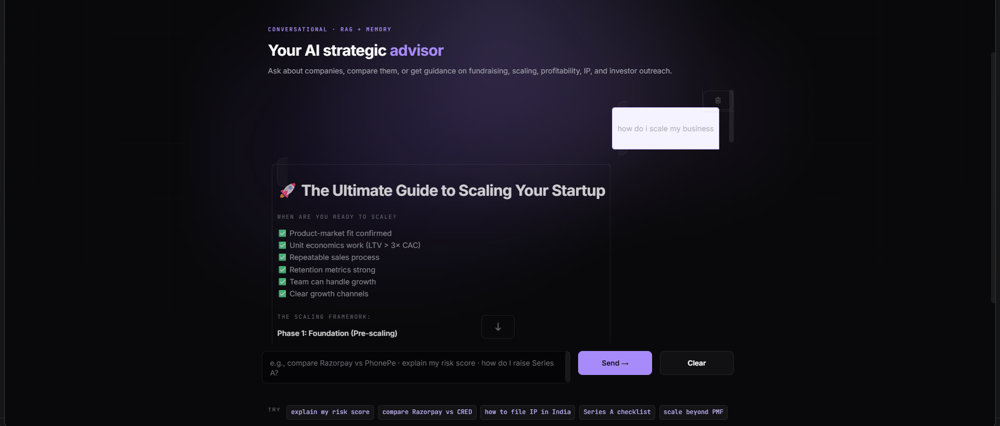
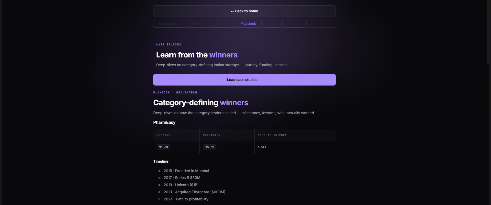
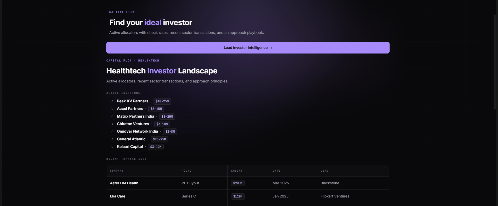
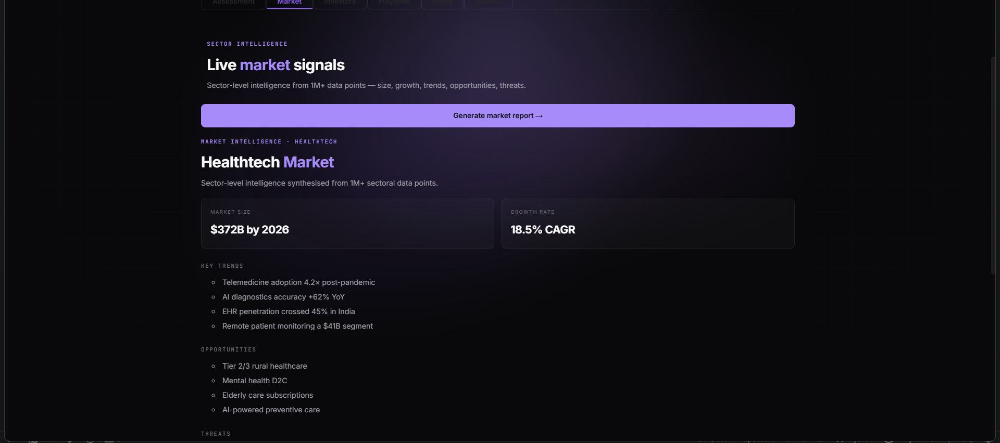
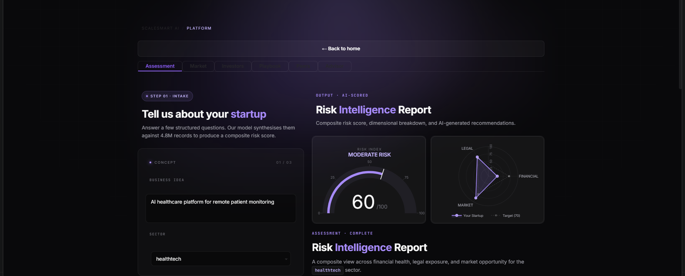
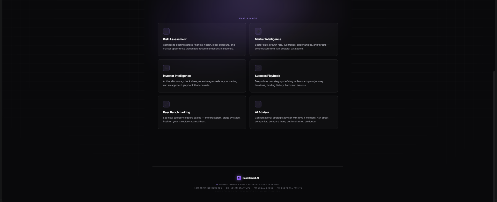
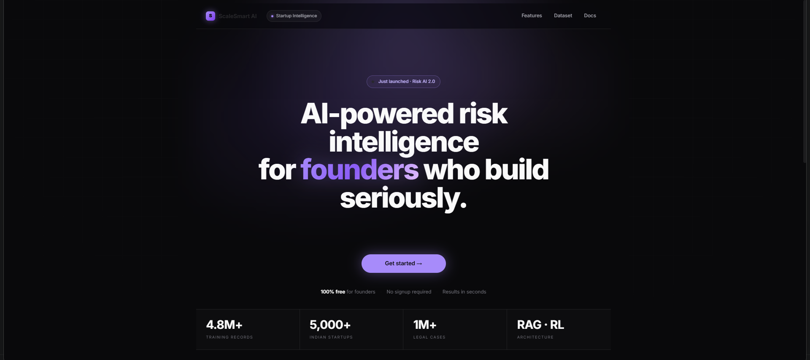

# ScaleSmart AI

AI-powered startup intelligence platform integrating financial, legal, sectoral, investor, and market intelligence through transformer models, reinforcement learning, RAG systems, and adaptive risk analytics.

---

## Overview

ScaleSmart AI is an integrated startup intelligence platform designed to explore adaptive AI-driven decision-support systems for founders, venture ecosystems, and early-stage startup evaluation workflows.

The platform combines multi-domain intelligence pipelines across:
- financial analysis,
- legal intelligence,
- market intelligence,
- investor intelligence,
- peer benchmarking,
- and conversational strategic advisory systems.

---

## Core Capabilities

- AI-driven startup risk assessment
- Financial intelligence analysis
- Legal compliance intelligence
- Sectoral market intelligence
- Investor landscape analysis
- Peer benchmarking systems
- Conversational AI strategic advisor
- Reinforcement learning optimization
- Retrieval-augmented intelligence workflows
- Adaptive startup scoring systems

---

## Research Components

- FinBERT financial intelligence systems
- LegalBERT adaptation for Indian legal ecosystems
- Reinforcement learning optimization
- Retrieval-augmented generation pipelines
- Explainable AI workflows
- Multi-domain startup intelligence orchestration

---

## Technology Stack

- PyTorch
- TensorFlow
- BERT Architectures
- Reinforcement Learning
- RAG Systems
- NLP Pipelines
- Quantitative Analytics
- Gradio
- Hugging Face

---

## Platform Preview

### Landing Interface

---

### Startup Assessment

---

### Market Intelligence

---

### Investor Intelligence

---

### Startup Playbooks

---

### Peer Benchmarking

---

### Conversational AI Advisor

---

## Evaluation Snapshot

Initial implementation experiments demonstrated strong integrated multi-domain intelligence performance across:
- financial analysis,
- legal intelligence,
- sectoral analytics,
- retrieval systems,
- and adaptive risk evaluation workflows.

Detailed benchmark summaries are available in the benchmarks section.

---

## Research Publication

The framework was presented at the 2nd International Conference on Recent Advances in Technology & Management (ICRATM-2026).

---

## Current Status

Active research and development.

This repository currently serves as a technical and research showcase.

Detailed orchestration systems, backend infrastructure, datasets, and production deployment components remain private.

---
